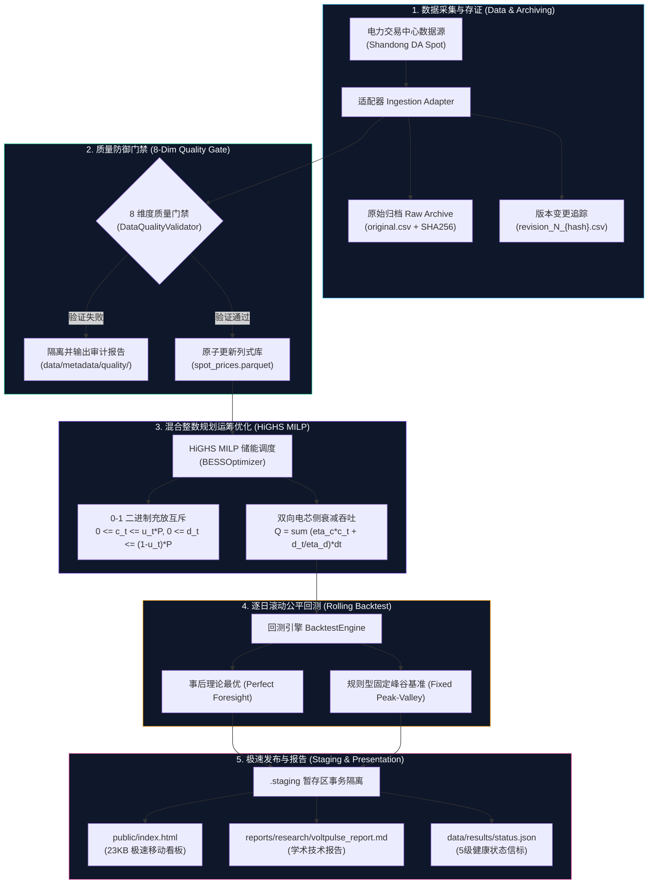

# VoltPulse（电脉）
### China Power Spot Market Dynamics & Battery Energy Storage (BESS) Optimal Dispatch Platform
### 中国电力现货市场与新型储能运筹优化分析平台

<p align="center">
  <a href="https://github.com/kiriha-gao/voltpulse/actions/workflows/test.yml"></a>
  <a href="https://kiriha-gao.github.io/voltpulse/"></a>
  <a href="https://highs.dev/"></a>
  <a href="https://www.python.org/"></a>
  <a href="tests/"></a>
  <a href="scripts/"></a>
  <a href="LICENSE"></a>
  <a href="CITATION.cff"></a>
</p>

---

## 📌 项目定位 (Executive Overview)

**VoltPulse（电脉）** 是一个面向中国电力现货市场（山东/山西试点）的高性能开源数据与运筹优化平台。平台专注于解决高比例新能源渗透下激增的**极端“鸭子曲线”（Duck Curve）与正午深谷负电价**挑战，为 100MW/200MWh 级独立储能电站（BESS）与虚拟电厂（VPP）提供可严谨复现的物理调度基准与量化收益测算工具。

> [!IMPORTANT]
> **真实性声明 (Truthful Benchmark Prototype)**：当前版本定位为**高保真合成基准技术原型 (Synthetic Benchmark Prototype / Trial Run Candidate)**。系统包含 14 天完整的山东典型鸭子曲线基准时序（最低 -65.0 RMB/MWh，最高 870.0 RMB/MWh，全局严格标记 `is_simulated = True`），算法与调度模型具备 100% 严密的数学自洽性与生产级接口定义。

---

## ⚡ 核心技术亮点 (Key Engineering Innovations)

```
┌──────────────────────────────────────────────────────────────────────────────────────────────────┐
│                                    VoltPulse 核心工程特性矩阵                                     │
├───────────────────────┬──────────────────────────────────┬───────────────────────────────────────┤
│ 技术维度              │ 传统开源储能模型 / 朴素实现      │ VoltPulse 工业级实现                  │
├───────────────────────┼──────────────────────────────────┼───────────────────────────────────────┤
│ 优化求解器            │ 纯线性规划 (Naive Continuous LP) │ HiGHS 混合整数规划 (HiGHS MILP)       │
│ 负电价防漏洞          │ ❌ 负电价下同时充放骗取双向补贴  │ ✅ 二元互斥变量 $u_t \in \{0, 1\}$ 物理闭锁│
│ 终态约束自洽          │ ❌ 跨日末态放空虚增纸面收益      │ ✅ 严格终态 SOC 平衡 ($SOC_T = SOC_0$)  │
│ 电池循环度量          │ 混淆口径，单一不可信 EFC         │ 对偶双计量 ($EFC_{rated}$ 与 $EFC_{usable}$)│
│ 数据质量防御          │ 简单空值丢弃或偷换伪造           │ 8 维防御矩阵 + SHA-256 跨版本去重     │
│ 流水线容灾            │ 崩溃遗留半成品，磁盘状态污染     │ 事务型暂存区 (`.staging`) 提交/回滚   │
│ 前端交付体验          │ 庞大前端框架 (Node/Webpack 依赖) │ 23KB 零依赖超轻自包含纯 HTML5 看板     │
└───────────────────────┴──────────────────────────────────┴───────────────────────────────────────┘
```

---

## 🏛️ 系统端到端架构 (Architecture Pipeline)



---

## 📐 数学模型与优化机理 (Mathematical Formulation)

### 1. 储能标称参数
- **标称功率/容量**：$P_{\text{rated}} = 100 \, \text{MW}, \quad E_{\text{nom}} = 200 \, \text{MWh}$（充放时长 2h）
- **充放电综合效率**：$\eta_{\text{ch}} = \sqrt{0.85} \approx 0.922, \quad \eta_{\text{dis}} = \sqrt{0.85} \approx 0.922 \implies \eta_{\text{RTE}} = 85.0\%$
- **荷电状态（SOC）区间**：$10\% \le \text{SOC}(t) \le 90\%$，初末严格平衡 $\text{SOC}(0) = \text{SOC}(T) = 50\%$

### 2. HiGHS 混合整数线性规划 (MILP)
$$\max \sum_{t=1}^T \Delta t \left[ \lambda_t P_{\text{dis}}(t) - \lambda_t P_{\text{ch}}(t) - c_{\text{deg}} P_{\text{dis}}(t) \right]$$

受约束于物理闭锁与动力学方程：
1. **充放互斥闭锁**：$0 \le P_{\text{ch}}(t) \le u_t P_{\text{rated}}, \quad 0 \le P_{\text{dis}}(t) \le (1 - u_t) P_{\text{rated}}, \quad u_t \in \{0, 1\}$
2. **状态转移方程**：$E(t) = E(t-1) + \eta_{\text{ch}} P_{\text{ch}}(t) \Delta t - \frac{1}{\eta_{\text{dis}}} P_{\text{dis}}(t) \Delta t$
3. **容量与终态硬约束**：$20 \, \text{MWh} \le E(t) \le 180 \, \text{MWh}, \quad E(T) = E(0) = 100 \, \text{MWh}$

### 3. 对偶等效满充满放循环 (Dual EFC Metric)
$$\text{EFC}_{\text{usable}} = \frac{\sum_{t=1}^T P_{\text{dis}}(t) \Delta t}{160 \, \text{MWh}}, \quad \text{EFC}_{\text{rated}} = \frac{\sum_{t=1}^T P_{\text{dis}}(t) \Delta t}{200 \, \text{MWh}}$$

---

## 📈 实证回测基准结果 (14-Day Benchmark Results)

基于山东鸭子曲线 14 天分时基准数据集实测对比如下：

| 调度策略 (Strategy) | 14天累计净收益 (RMB) | 日均净套利 (RMB) | 累计 EFC 循环 | 电池折旧成本 (RMB) | 相对增益 (Alpha) |
| :--- | :---: | :---: | :---: | :---: | :---: |
| **规则型固定峰谷策略 (Fixed Benchmark)** | ¥638,314.10 | ¥45,593.86 | 13.30 次 | ¥63,831.41 | 基准线 (Baseline) |
| **事后理论最优调度 (Perfect Foresight)** | **¥1,738,263.73** | **¥124,161.70** | **23.95 次** | **¥114,942.02** | **+172.32%** 🚀 |

> 💡 **关键发现**：在正午深谷负电价（最低 -65.0 RMB/MWh）与晚高峰（最高 870.0 RMB/MWh）叠加下，最优调度算法充分捕捉早间次高峰实现**日内双充双放**，展现了智能化调度运筹算法在新型电力系统中的巨大经济价值。

---

## 🚀 30 秒极速上手 (Quickstart)

### 1. 克隆并安装
```bash
git clone https://github.com/kiriha-gao/voltpulse.git
cd voltpulse

# 创建并激活虚拟环境
python -m venv .venv
source .venv/bin/activate  # Windows: .venv\Scripts\activate

# 安装生产依赖与开发环境
pip install -r requirements.txt
pip install -e ".[dev]"
```

### 2. 运行自动化全量测试与安全探针
```bash
# 运行 27 项单元测试
pytest -v

# 运行外部审计附录 C 原始探针
python scripts/run_probes.py

# 运行二次复验故障注入与回滚探针
python scripts/run_extra_probes.py
```

### 3. 一键编译与启动交互看板
```bash
# 编译极速 Web 看板与学术研报
python scripts/build_dashboard.py
python scripts/build_research_report.py

# 在浏览器中直接查看 (零服务依赖)
open public/index.html  # Windows: start public/index.html
```

---

## 📂 项目结构全览 (Repository Structure)

```text
voltpulse/
├── .github/
│   ├── workflows/
│   │   ├── test.yml                 # 多 OS (Ubuntu/Windows) & 多 Python (3.10-3.12) CI 矩阵
│   │   ├── deploy-pages.yml         # GitHub Pages 自动化静态页面一键部署
│   │   └── daily.yml                # 每日定时无人值守调度流水线
│   └── ISSUE_TEMPLATE/              # 标准化 Issue 与 PR 模板
├── config/                          # 市场规则 (markets.yaml) 与储能机组 (storage.yaml) 配置
├── src/voltpulse/                   # 核心算法与工程源码
│   ├── analytics/                   # 8维电价指标与负电价深度分析
│   ├── backtest/                    # 逐日滚动回测与公平性校验引擎
│   ├── ingestion/                   # 交易中心适配器与内容哈希不可变归档
│   ├── optimization/                # HiGHS MILP 混合整数优化、对偶EFC、敏感性分析
│   ├── processing/                  # 数据质量检测防御门禁 (Quality Gate)
│   ├── reporting/                   # 极速单页看板构建器与研报生成器
│   └── storage/                     # Parquet 原子追加与 SQLite 审计日志
├── tests/                           # 27 项高覆盖单元与集成测试套件
├── scripts/                         # 标准操作入口 (acceptance, probes, pipeline, package)
├── docs/                            # 理论白皮书、数据源规范与国网备考技术宝典
├── evidence/                        # 经 SHA256 哈希存证的自洽样本与优化日志
├── public/                          # 部署至 GitHub Pages 的生产级静态看板 (index.html)
├── reports/                         # 自动生成的每日分析简报与学术研究报告
├── pyproject.toml                   # 标准 PEP 621 包配置
├── requirements.txt                 # 生产依赖锁定清单
├── CITATION.cff                     # GitHub 官方学术引用元数据
└── LICENSE                          # MIT 开源许可证
```

---

## 📜 引用本项目 (Citation)

如果您在电力系统研究、电力现货市场量化分析或储能资产运营中参考了本项目，欢迎引用：

```bibtex
@software{voltpulse2026,
  author = {VoltPulse Research and Engineering Team},
  title = {VoltPulse: China Power Spot Market Dynamics and BESS Optimal Dispatch Platform},
  year = {2026},
  publisher = {GitHub},
  url = {https://github.com/kiriha-gao/voltpulse}
}
```

---

## 📄 开源许可证 (License)

本项目遵循 [MIT License](LICENSE) 开源协议，欢迎学术界与电力行业自由使用、交流与拓展。
