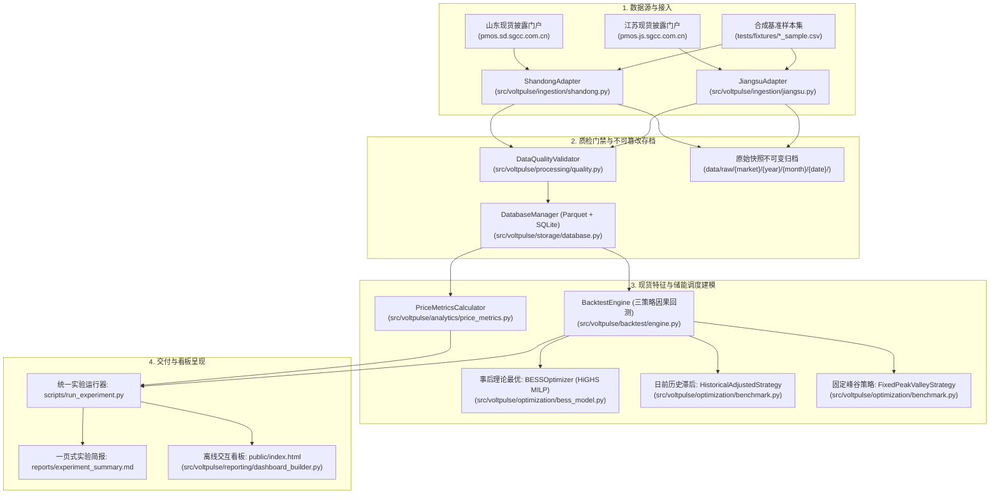

# VoltPulse 端到端全链路追踪矩阵 (Traceability Matrix)

> 本文档建立从 **数据源 $\rightarrow$ 配置文件 $\rightarrow$ 源码实现 $\rightarrow$ 指标计算 $\rightarrow$ 交付物产出** 的 100% 显式追踪链条，确保系统任意数值和图表均可向前追溯至物理机理与代码源头。

---

## 1. 核心链路端到端总览

---

## 2. 模块级代码与配置追踪表

| 环节 | 对应配置文件 / 路径 | 核心代码实现文件 | 关键类 / 函数 | 对应的单元测试 |
| :--- | :--- | :--- | :--- | :--- |
| **基础配置** | `configs/default.yaml` | `src/voltpulse/utils/config.py` | `ConfigManager.get_config()` | `tests/test_storage.py` |
| **山东现货接入** | `configs/default.yaml` (`markets.shandong`) | `src/voltpulse/ingestion/shandong.py` | `ShandongAdapter.fetch()` | `tests/test_ingestion.py::test_shandong_adapter_ingest_from_fixture` |
| **江苏现货接入** | `configs/default.yaml` (`markets.jiangsu`) | `src/voltpulse/ingestion/jiangsu.py` | `JiangsuAdapter.fetch()` | `tests/test_ingestion.py::test_jiangsu_adapter_ingest_from_fixture` |
| **网络鲁棒抓取** | `configs/default.yaml` (`network`) | `src/voltpulse/ingestion/downloader.py` | `RobustDownloader.get()` | `tests/test_pipeline.py::test_pipeline_live_mode_handles_missing_dates_safely` |
| **不可变原始存档**| `data/raw/{market}/{year}/{month}/{date}/` | `src/voltpulse/ingestion/base.py` | `MarketDataSource.save_raw_archive()` | `scripts/run_probes.py` (Probe 3) |
| **数据质量门禁** | `src/voltpulse/storage/schemas.py` | `src/voltpulse/processing/quality.py` | `DataQualityValidator.validate_daily_spot_prices()` | `tests/test_quality.py` (全量6项测试) |
| **Parquet与审计库**| `data/processed/spot_prices.parquet` | `src/voltpulse/storage/database.py` | `DatabaseManager.append_and_deduplicate()` | `tests/test_storage.py` (全量3项测试) |
| **现货统计分析** | `configs/default.yaml` (`analytics`) | `src/voltpulse/analytics/price_metrics.py` | `PriceMetricsCalculator.calculate_daily_metrics()` | `tests/test_metrics.py::test_price_metrics_calculator` |
| **负电价分析** | `configs/default.yaml` (`analytics`) | `src/voltpulse/analytics/negative_price.py` | `NegativePriceAnalyzer.analyze_daily_negative_prices()`| `tests/test_metrics.py::test_negative_price_analyzer` |
| **储能物理建模** | `configs/default.yaml` (`storage.bess_standard_100mw_200mwh`)| `src/voltpulse/optimization/bess_model.py` | `BESSOptimizer` (HiGHS MILP 互斥调度) | `tests/test_bess_model.py` (全量11项测试) |
| **电池衰减模型** | `configs/default.yaml` (`storage.degradation`) | `src/voltpulse/optimization/bess_model.py` | `BatteryDegradationModel.calculate_daily_metrics()` | `tests/test_bess_model.py::test_battery_degradation_dual_efc` |
| **历史滞后策略** | - | `src/voltpulse/optimization/benchmark.py` | `HistoricalAdjustedStrategy.simulate()` | `tests/test_strategy_comparison.py::test_regime_shift_failure_case` |
| **固定峰谷基准** | `configs/default.yaml` (`benchmark.fixed_strategy`) | `src/voltpulse/optimization/benchmark.py` | `FixedPeakValleyStrategy.simulate()` | `scripts/run_probes.py` (Probe 4) |
| **三策略回测引擎**| `configs/default.yaml` (`benchmark`) | `src/voltpulse/backtest/engine.py` | `BacktestEngine.run_backtest()` | `tests/test_strategy_comparison.py::test_three_strategies_14_days_execution` |
| **离线仪表盘** | `public/index.html` | `src/voltpulse/reporting/dashboard_builder.py` | `DashboardBuilder.build_dashboard()` | `tests/test_reporting.py::test_dashboard_builder` |
| **单页实验简报** | `reports/experiment_summary.md` | `scripts/run_experiment.py` | `_generate_markdown_summary()` | `scripts/run_experiment.py` (CLI 校验) |

---

## 3. 核心量化指标计算口径追踪

| 指标名称 | 代码字段名 | 统一数学公式 | 分母口径 | 物理与业务意义 |
| :--- | :--- | :--- | :--- | :--- |
| **放电毛收入** | `gross_revenue` | \(R = \sum_{t} p_t \cdot d_t \cdot \Delta t\) | - | 储能向电网注入电能获得的市场出清电费 |
| **充电购电成本** | `charging_cost` | \(C_{\text{ch}} = \sum_{t} p_t \cdot c_t \cdot \Delta t\) | - | 储能从电网吸收电能支付的市场出清电费（负电价时成本为负，即反向收益） |
| **电芯双向吞吐量**| `cell_throughput_q_mwh` | \(Q = \sum_{t} (\eta_c c_t + \frac{d_t}{\eta_d}) \cdot \Delta t\) | - | 穿过电芯活性物质的总双向电能（真实损耗微观度量） |
| **电芯折旧衰减成本**| `degradation_cost` | \(C_{\text{deg}} = k_{\text{deg}} \cdot Q\) | - | 计及 30 元/MWh 的电化学容量不可逆衰减摊销 |
| **核算净收益** | `net_profit` | \(\Pi = R - C_{\text{ch}} - C_{\text{deg}}\) | - | 扣除用电成本与电池寿命衰减后的真实经济净收益 |
| **额定 EFC 循环** | `efc_rated` | \(\text{EFC}_{\text{rated}} = \frac{Q}{2 \cdot E_{\text{rated}}}\) | 额定容量 (200 MWh) | 对应铭牌额定容量的等效充放电循环次数 |
| **可用 EFC 循环** | `efc_usable` | \(\text{EFC}_{\text{usable}} = \frac{Q}{2 \cdot E_{\text{usable}}}\) | 可用容量 (160 MWh) | 对应在 \([0.10, 0.90]\) SOC 允许工况下的等效充放电循环次数 |
| **峰谷价差** | `peak_valley_spread` | \(\Delta p = \max(p_t) - \min(p_t)\) | - | 当日最高出清价与最低出清价之差，套利空间核心指标 |
| **负电价时长** | `negative_price_hours` | \(H_{\text{neg}} = N_{p_t < 0} \cdot 0.25\) 小时 | - | 15 分钟粒度下出清价小于 0 元/MWh 的累计小时数 |

---

## 4. 关键验证与审查断言映射

| 审查要求项 | 对应的自动化检查脚本 | 检验断言标准 | 当前系统验证状态 |
| :--- | :--- | :--- | :--- |
| **合成基准一致性** | `scripts/run_probes.py` (Probe 1) | 1344 笔记录与生成器完全一致，哈希与元数据相符 | **100% PASS** |
| **数据质检负向拦截** | `scripts/run_probes.py` (Probe 2) | 日期错误、粒度错误、省份错误、仿真泄露全部拦截 | **100% PASS** |
| **原始存档不可变** | `scripts/run_probes.py` (Probe 3) | 多次重复抓取以 `revision` 保存，`original.csv` 不变 | **100% PASS** |
| **短窗口终态平衡** | `scripts/run_probes.py` (Probe 4) | 窗口不足无法归还 SOC 时，安全退化为待机（SOC=0.5） | **100% PASS** |
| **半天与混杂拒绝** | `scripts/run_probes.py` (Probe 5) | 不足 96 点或日前/实时混杂数据拒绝回测（结果为0） | **100% PASS** |
| **测试沙箱物理隔离** | `scripts/run_probes.py` (Probe 6) | fixture 模式运行绝不向生产 Parquet 和 HTML 写入 | **100% PASS** |
| **断网故障真实上报** | `scripts/run_probes.py` (Probe 7) | 断网时状态记录 `failed`，退出码严格为 1，无伪造分支 | **100% PASS** |
| **验收审计动态报告** | `scripts/run_probes.py` (Probe 8) | 命令执行失败时，项目状态绝不谎报发布资格通过 | **100% PASS** |
| **三策略完整因果回测**| `tests/test_strategy_comparison.py` | 14天产出 42 笔回测记录，转折期验证时滞失真巨亏 | **100% PASS** |
